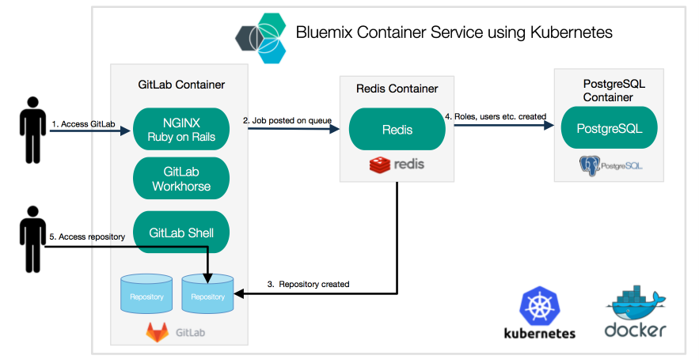

[](https://travis-ci.org/IBM/kubernetes-container-service-gitlab-sample)

# GitLab deployment on Bluemix Container Service using Kubernetes

This project shows how a common multi-component application can be deployed on the Bluemix Kubernetes Container service. Bluemix Container Service combines Docker and Kubernetes to deliver powerful container orchestration.

GitLab represents a typical multi-tier app and each component will have their own container(s). The microservice containers will be for the web tier, the state/job database with Redis and PostgreSQL as the database.

The user interacts with GitLab via the web interface or by pushing code to a Git repo. The GitLab container runs the main Ruby on Rails application behind NGINX and gitlab-workhorse, which is a reverse proxy for large HTTP requests like file downloads and Git push/pull. When serving repositories over HTTP/HTTPS, GitLab utilizes the GitLab API to resolve authorization and access as well as serving Git objects.



## Included Components
- Bluemix container service
- Kubernetes
- GitLab
- NGINX
- Redis
- PostgreSQL

## Prerequisite

Create a Kubernetes cluster with IBM Bluemix Container Service. 

If you have not setup the Kubernetes cluster, please follow the [Creating a Kubernetes cluster](https://github.com/IBM/container-journey-template) tutorial.


## Steps

1. [Install Docker CLI and Bluemix Container registry Plugin](#1-install-docker-cli-and-bluemix-container-registry-plugin)
2. [Build PostgreSQL and Gitlab containers](#2-build-postgresql-and-gitlab-containers)
3. [Create Services and Deployments](#3-create-services-and-deployments)
4. [Using Gitlab](#4-using-gitlab)

# 1. Install Docker CLI and Bluemix Container Registry Plugin


First, install [Docker CLI](https://www.docker.com/community-edition#/download).

Then, install the Bluemix container registry plugin.

```bash
bx plugin install container-registry -r bluemix
```

Once the plugin is installed you can log into the Bluemix Container Registry.

```bash
bx cr login
```

If this is the first time using the Bluemix Container Registry you must set a namespace which identifies your private Bluemix images registry. It can be between 4 and 30 characters.

```bash
bx cr namespace-add <namespace>
```

Verify that it works.

```bash
bx cr images
```


# 2. Build PostgreSQL and GitLab containers

PostgreSQL and GitLab containers need to be built. Redis container can be used as is from Docker Hub

Build the PostgreSQL container.

```bash
cd containers/postgres
docker build -t registry.ng.bluemix.net/<namespace>/gitlab-postgres .
docker push registry.ng.bluemix.net/<namespace>/gitlab-postgres
```

Build the GitLab container.

```bash
cd containers/gitlab
docker build -t registry.ng.bluemix.net/<namespace>/gitlab .
docker push registry.ng.bluemix.net/<namespace>/gitlab
```


After finish building the images in bluemix registery, please modify the container images in your yaml files. 

i.e. 
1. In postgres.yaml, change `docker.io/tomcli/postgres:latest` to `registry.ng.bluemix.net/<namespace>/gitlab-postgres`
2. In gitlab.yaml, change `docker.io/tomcli/gitlab:latest` to `registry.ng.bluemix.net/<namespace>/gitlab`

> Note: Replace `<namespace>` to your own container registry namespace. You can check your namespace via `bx cr namespaces`

# 3. Create Services and Deployments

Run the following commands or run the quickstart script `bash quickstart.sh` with your Kubernetes cluster.

```bash
kubectl create -f local-volumes.yaml
kubectl create -f postgres.yaml
kubectl create -f redis.yaml
kubectl create -f gitlab.yaml
```

After you have created all the services and deployments, wait for 3 to 5 minutes. You can check the status of your deployment on Kubernetes UI. Run 'kubectl proxy' and go to URL 'http://127.0.0.1:8001/ui' to check when the GitLab container becomes ready.


After few minutes the following commands to get your public IP and NodePort number.

```bash
$ kubectl get nodes
NAME             STATUS    AGE
169.47.241.106   Ready     23h
$ kubectl get svc gitlab
NAME      CLUSTER-IP     EXTERNAL-IP   PORT(S)                     AGE
gitlab    10.10.10.148   <nodes>       80:30080/TCP,22:30022/TCP   2s
```

> Note: The 30080 port is for gitlab UI and the 30022 port is for ssh.

Congratulation. Now you can use the link **http://[IP]:30080** to access your gitlab site on browser.

> Note: For the above example, the link would be http://169.47.241.106:30080  since its IP is 169.47.241.106 and the UI port number is 30080. 


# 4. Using GitLab
Now that Gitlab is running you can register as a new user and create a project.


After logging in as your newly-created user you can create a new project.


Once a project has been created you'll be asked to add an SSH key for your user.

To verify that your key is working correctly run:

```bash
ssh -T git@<IP> -p 30022
```

Which should result in:

```bash
Welcome to GitLab, <user>!
```

Now you can clone your project.
```bash
git clone ssh://git@<IP>:30022/<user>/<project name>
```

Add a file and commit:
```bash
echo "Gitlab project" > README.md
git add README.md
git commit -a -m "Initial commit"
git push origin master
```

You can now see it in the Gitlab UI.


If you want to use http URLs for cloning and pushing to a public repository on GitLab, that`s enabled in the current deplyoment as well.

# Troubleshooting
If a pod doesn't start examine the logs.
```bash
kubectl get pods
kubectl logs <pod name>
```


To delete all your services, deployments, and persistent volume claim, run

```bash
kubectl delete deployment,service,pvc -l app=gitlab
```

To delete your persistent volume, run

```bash
kubectl delete pv local-volume-1 local-volume-2 local-volume-3
```

# License
[Apache 2.0](LICENSE.txt)
