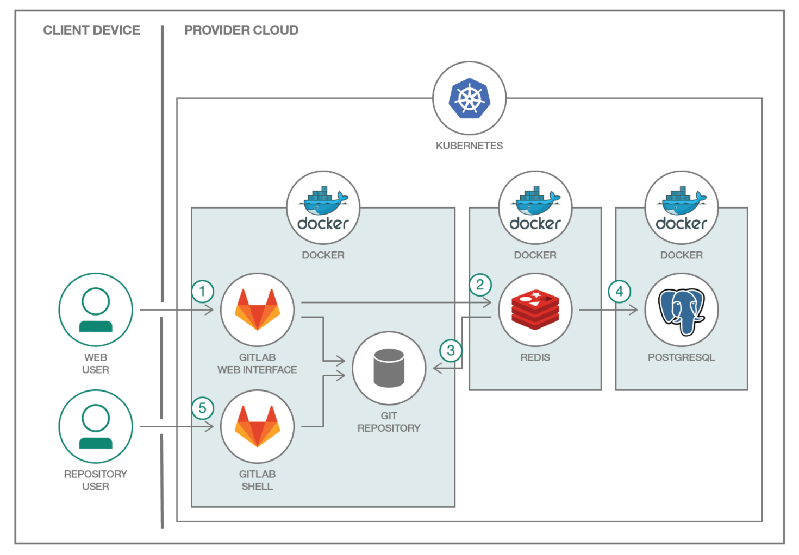

[](https://travis-ci.org/IBM/kubernetes-container-service-gitlab-sample)

# GitLab deployment on Kubernetes Cluster

This project shows how a common multi-component workload, in this case GitLab can be deployed on Kubernetes Cluster.  GitLab is famous for its Git-based and code-tracking tool that programmers can easily install. GitLab represents a typical multi-tier app and each component will have their own container(s). The microservice containers will be for the web tier, the state/job database with Redis and PostgreSQL as the database. 

By using different GitLab components (NGINX, Ruby on Rails, Redis, PostgreSQL, and more), you can deploy it to Kubernetes. This example is also deployable using Compose for PostgreSQL in Bluemix as the database.



1. The user interacts with GitLab via the web interface or by pushing code to a GitHub repository. The GitLab container runs the main Ruby on Rails application behind NGINX and gitlab-workhorse, which is a reverse proxy for large HTTP requests like file downloads and Git push/pull. While serving repositories over HTTP/HTTPS, GitLab utilizes the GitLab API to resolve authorization and access and serves Git objects.

2. After authentication and authorization, the GitLab Rails application puts the incoming jobs, job information, and metadata on the Redis job queue that acts as a non-persistent database.

3. Repositories are created in a local file system.

4. The user creates users, roles, merge requests, groups, and more—all are then stored in PostgreSQL.

5. The user accesses the repository by going through the Git shell.

## Included Components
- Kubernetes (1.5.3)
- Bluemix container service
- GitLab
- NGINX
- Redis (alpine)
- PostgreSQL

## Objectives

This scenario provides instructions for the following tasks:

- Build GitLab and/or PostgreSQL containers, and store them in container registry
- Create local persistent volumes to define persistent disks for GitLab and PostgreSQL
- Create and deploy the GitLab and Redis container
- Create and deploy the PostgreSQL database(either in a container or using Bluemix PostgreSQL as backend).

## Prerequisite

Create a Kubernetes cluster with either [Minikube](https://kubernetes.io/docs/getting-started-guides/minikube) for local testing, or with [IBM Bluemix Container Service](https://github.com/IBM/container-journey-template) to deploy in cloud. The code here is regularly tested against [Kubernetes Cluster from Bluemix Container Service](https://console.ng.bluemix.net/docs/containers/cs_ov.html#cs_ov) using Travis.

## Steps

1. [Install Docker CLI](#1-install-docker-cli)
2. [Build and push GitLab Container Images](#2-build-and-push-gitlab-container-images)
3. [Create Services and Deployments](#3-create-services-and-deployments)
4. [Using Gitlab](#4-using-gitlab)

Alternatively, to deploy the Gitlab application using Compose for PostgreSQL on Bluemix as the database, please follow the [Compose for PostgreSQL on Bluemix steps ](README-bluemix-postgres.md)

# 1. Install Docker CLI

First, install [Docker CLI](https://www.docker.com/community-edition#/download).

You can use Docker hub for storing your images. Optionally, to use Bluemix Container Registry, install this plugin.

```bash
bx plugin install container-registry -r bluemix
```

Once the plugin is installed you can log into the Bluemix Container Registry.

```bash
bx cr login
```

If this is the first time using the Bluemix Container Registry you must set a namespace which identifies your private Bluemix images registry. It can be between 4 and 30 characters.

```bash
bx cr namespace-add <namespace>
```

Verify that it works.

```bash
bx cr images
```

# 2. Build and push GitLab Container Images

GitLab and PostgreSQL container images need to be built. Redis container can be used as is from Docker Hub. If you are using Compose for PostgreSQL as backend, you only need to build GitLab image.

Build and push the GitLab container.

```bash
cd containers/gitlab
docker build -t registry.ng.bluemix.net/<namespace>/gitlab .
docker push registry.ng.bluemix.net/<namespace>/gitlab
```
Build and push the PostgreSQL container.

```bash
cd containers/postgres
docker build -t registry.ng.bluemix.net/<namespace>/gitlab-postgres .
docker push registry.ng.bluemix.net/<namespace>/gitlab-postgres
```

After you finish building and pushing the images in registery, please modify the container images in your yaml files.

i.e.
Replace `<namespace>` to your own container registry namespace. You can check your namespace via `bx cr namespaces` for 

# 3. Create Services and Deployments

Run the following commands or run the quickstart script `bash quickstart.sh` with your Kubernetes cluster.

```bash
kubectl create -f local-volumes.yaml
kubectl create -f postgres.yaml
kubectl create -f redis.yaml
kubectl create -f gitlab.yaml
```

After you have created all the services and deployments, wait for 3 to 5 minutes. You can check the status of your deployment on Kubernetes UI. Run 'kubectl proxy' and go to URL 'http://127.0.0.1:8001/ui' to check when the GitLab container becomes ready.


After few minutes the following commands to get your public IP and NodePort number.

```bash
$ kubectl get nodes
NAME             STATUS    AGE
169.47.241.106   Ready     23h
$ kubectl get svc gitlab
NAME      CLUSTER-IP     EXTERNAL-IP   PORT(S)                     AGE
gitlab    10.10.10.148   <nodes>       80:30080/TCP,22:30022/TCP   2s
```

> Note: The 30080 port is for gitlab UI and the 30022 port is for ssh.

Congratulation. Now you can use the link **http://[IP]:30080** to access your gitlab site on browser.

> Note: For the above example, the link would be http://169.47.241.106:30080  since its IP is 169.47.241.106 and the UI port number is 30080.


# 4. Using GitLab
Now that Gitlab is running you can register as a new user and create a project.


After logging in as your newly-created user you can create a new project.


Once a project has been created you'll be asked to add an SSH key for your user.

To verify that your key is working correctly run:

```bash
ssh -T git@<IP> -p 30022
```

Which should result in:

```bash
Welcome to GitLab, <user>!
```

Now you can clone your project.
```bash
git clone ssh://git@<IP>:30022/<user>/<project name>
```

Add a file and commit:
```bash
echo "Gitlab project" > README.md
git add README.md
git commit -a -m "Initial commit"
git push origin master
```

You can now see it in the Gitlab UI.


If you want to use http URLs for cloning and pushing to a public repository on GitLab, that`s enabled as well.

# Troubleshooting
If a pod doesn't start examine the logs.
```bash
kubectl get pods
kubectl logs <pod name>
```


To delete all your services, deployments, and persistent volume claim, run

```bash
kubectl delete deployment,service,pvc -l app=gitlab
```

To delete your persistent volume, run

```bash
kubectl delete pv local-volume-1 local-volume-2 local-volume-3
```

# License
[Apache 2.0](LICENSE)
