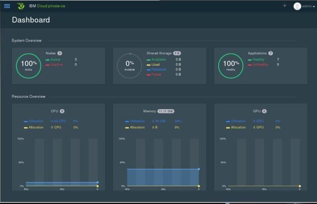

# Deploy with IBM Cloud private

Another option for getting a Kubernetes cluster up and running is to install it
on top of IBM Cloud private.

## Included Components

- [Vagrant](https://www.vagrantup.com)
- [VirtualBox](https://www.virtualbox.org)
- [IBM Cloud private](https://www.ibm.com/support/knowledgecenter/SSBS6K/product_welcome_cloud_private.html)
## Prerequisites

You will need to download and run the approprate installer of
[VirtualBox](https://www.virtualbox.org/wiki/Downloads) and
[Vagrant](https://www.vagrantup.com/downloads.html)

## Steps

### 1. Setup

First, we will need a vagrantfile to deploy our containers.
```text
nodes = [
  {:hostname => 'icp-worker1', :ip => '192.168.122.11', :box => 'centos/7', :cpu => 2, :memory => 4096},
  {:hostname => 'icp-worker2', :ip => '192.168.122.12', :box => 'centos/7', :cpu => 2, :memory => 4096},
  {:hostname => 'icp-master', :ip => '192.168.122.10', :box => 'centos/7', :cpu => 2, :memory => 4096},
]

# Please update the icp_config according to your laptop network
icp_config = '
network_type: calico
network_cidr: 10.1.0.0/16
service_cluster_ip_range: 10.0.0.0/24
ingress_enabled: true
ansible_user: vagrant
ansible_become: true
mesos_enabled: false
install_docker_py: true
'

# Please update if you want to use a specified version
icp_version = 'latest'

icp_hosts = "[master]\n#{nodes.last[:ip]}\n[proxy]\n#{nodes.last[:ip]}\n[worker]\n"
vagrant_hosts = "127.0.0.1 localhost\n"
nodes.each do |node|
  icp_hosts = icp_hosts + node[:ip] + "\n" unless (node == nodes.last && nodes.length != 1)
  vagrant_hosts = vagrant_hosts + "#{node[:ip]} #{node[:hostname]}\n"
end

Vagrant.configure(2) do |config|

  unless File.exists?('ssh_key')
    require "net/ssh"
    rsa_key = OpenSSL::PKey::RSA.new(2048)
    File.write('ssh_key', rsa_key.to_s)
    File.write('ssh_key.pub', "ssh-rsa #{[rsa_key.to_blob].pack("m0")}")
  end

  rsa_public_key = IO.read('ssh_key.pub')
  rsa_private_key = IO.read('ssh_key')

  config.vm.synced_folder ".", "/vagrant", disabled: true
  config.vm.provision "shell", inline: <<-SHELL
    echo "#{rsa_public_key}" >> /home/vagrant/.ssh/authorized_keys
    echo '[dockerrepo]' > /etc/yum.repos.d/docker.repo
    echo 'name=Docker Repository' >> /etc/yum.repos.d/docker.repo
    echo 'baseurl=https://yum.dockerproject.org/repo/main/centos/7/' >> /etc/yum.repos.d/docker.repo
    echo 'enabled=1' >> /etc/yum.repos.d/docker.repo
    echo 'gpgcheck=0' >> /etc/yum.repos.d/docker.repo
    yum clean all
    yum -y install docker-engine-1.12.3
    service network restart
    sysctl -w net.ipv4.ip_forward=1
    service docker start
    echo "#{vagrant_hosts}" > /etc/hosts
  SHELL

  nodes.each do |node|
    config.vm.define node[:hostname] do |nodeconfig|
      nodeconfig.vm.hostname = node[:hostname]
      nodeconfig.vm.box = node[:box]
      nodeconfig.vm.box_check_update = false
      nodeconfig.vm.network "private_network", ip: node[:ip]
      nodeconfig.vm.provider "virtualbox" do |virtualbox|
        virtualbox.gui = false
        virtualbox.cpus = node[:cpu]
        virtualbox.memory = node[:memory]
      end

      if node == nodes.last
        nodeconfig.vm.provision "shell", inline: <<-SHELL
          mkdir -p cluster
          echo "#{rsa_private_key}" > cluster/ssh_key
          echo "#{icp_hosts}" > cluster/hosts
          echo "#{icp_config}" > cluster/config.yaml
          docker run -e LICENSE=accept -v "$(pwd)/cluster":/installer/cluster ibmcom/cfc-installer:"#{icp_version}" install
        SHELL
      end
    end
  end

end
```

Write this `vagrantfile` into a directory on your local computer - this will
become your working directory from which you will issue all vagrant commands.

Then,
```bash
$ vagrant up
```

When the installation completes, the penultimate line of messages returned from
the installer contains the IP address as well as the default username and
password to access the ICp management console.

The beginning and end of the console output should look something like this:
```text
[mwagone@oc4258582282 icp]$ vagrant up
Bringing machine 'icp-worker1' up with 'virtualbox' provider...
Bringing machine 'icp-worker2' up with 'virtualbox' provider...
Bringing machine 'icp-master' up with 'virtualbox' provider...
==> icp-worker1: Importing base box 'centos/7'...
==> icp-worker1: Matching MAC address for NAT networking...
==> icp-worker1: Setting the name of the VM: icp_cfc-worker1_1505490687129_87343
==> icp-worker1: Clearing any previously set network interfaces...
==> icp-worker1: Preparing network interfaces based on configuration...
    icp-worker1: Adapter 1: nat
    icp-worker1: Adapter 2: hostonly
==> icp-worker1: Forwarding ports...
    icp-worker1: 22 (guest) => 2222 (host) (adapter 1)
==> icp-worker1: Running 'pre-boot' VM customizations...
==> icp-worker1: Booting VM...
==> icp-worker1: Waiting for machine to boot. This may take a few minutes...
    icp-worker1: SSH address: 127.0.0.1:2222
    icp-worker1: SSH username: vagrant
    icp-worker1: SSH auth method: private key
.
.
.
.
.
==> icp-master: PLAY RECAP *********************************************************************
==> icp-master: 192.168.123.10             : ok=118  changed=53   unreachable=0    failed=0   
==> icp-master: 192.168.123.11             : ok=52   changed=31   unreachable=0    failed=0   
==> icp-master: 192.168.123.12             : ok=52   changed=31   unreachable=0    failed=0   
==> icp-master: localhost                  : ok=87   changed=37   unreachable=0    failed=0   
==> icp-master: 
==> icp-master: 
==> icp-master: POST DEPLOY MESSAGE ************************************************************
==> icp-master: 
==> icp-master: UI URL is https://192.168.123.10:8443 , default username/password is admin/admin
==> icp-master: Playbook run took 0 days, 0 hours, 23 minutes, 40 seconds
```

Use the UI URL in a web browser (without SSL to avoid complaints from the
browser) and you will see the dashboard.  It may take a few minutes for the
'Applications' sectoin on the upper right to read that they are healthy.



### 2. Import Docker images

To push images to the repository, we must first create a namespace and user.
To create a namespace, select 'System' from the navigation menu in the upper
left corner.


Select the 'Namespace' header, and then click the light blue 'New Namespace'
button on the right.  Give your new namespace a title (e.g. 'gitlab') and
then click 'Add Namespace'.

Now, to add a user to a namespace:

Select the 'Users' header, and then click the light blue 'New User' button on
the right.  Enter "user1" as the user name, and provide a password.  Select the
'gitlab' namespace and then click 'Add User'.

Now we are ready to upload our Gitlab image.  First, pull the Gitlab image from
Docker Hub:

    docker pull gitlab-ce

Login to your local image registry with the user user1 that you created above.

    docker login master.cfc:8500

Tag the image with proper naming convention: (master.cfc:8500/namespace/image_name:tagname)

    docker tag gitlab-ce master.cfc:8500/gitlab/gitlabce1:0.1

Push the image to local image registry

    docker push master.cfc:8500/gitlab/gitlabce1:0.1

### 3. Deploy the Application

From navigation menu, select Applications, and then Deploy Applicaiton.  Then
on the General tab, provide an application name.  On the Container Settings
tab, provide a container name, image name, and port.

    Application name: icp-gitlab

    Container name: icp-gitlab

    Image name: master.cfc:8500/admin/gitlabce:0.1

    Container port: 80

Finally, select Deploy.
